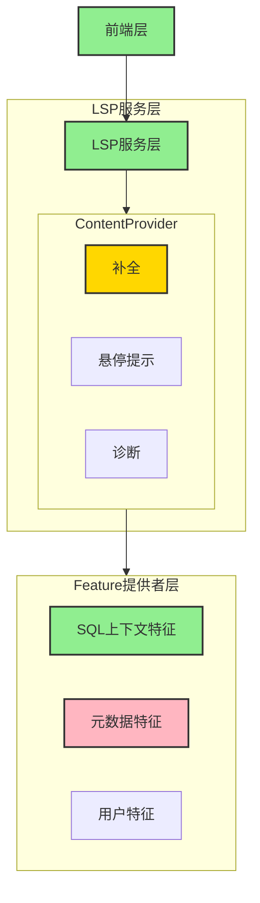
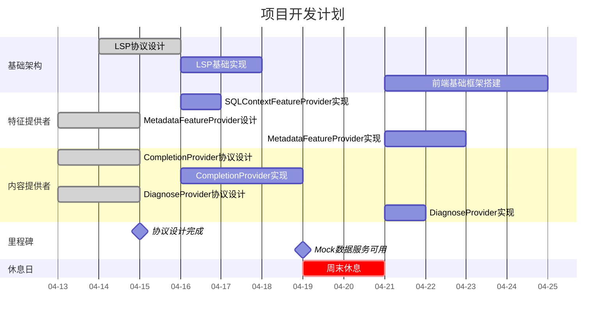

# 项目架构报告

## 项目概述

本项目基于 LSP (Language Server Protocol) 构建，采用分层架构设计，实现了代码补全、悬停提示和诊断等功能。

## 系统架构

## 项目甘特图

## 当前进度

### 已完成组件

- ✅ HoverProvider 协议已完成
- ✅ DiagnoseProvider 协议已完成
- ✅ CompletionProvider 协议已完成
- ✅ MetadataFeatureProvider 协议已完成

- ✅ SQLContextFeatureProvider 基本功能

### 进行中组件

- 🔄 CompletionProvider 开发中
- 🔄 DiagnoseProvider 开发中

### 未开始开发

- ❌ LSP 未开始实现
- ❌ 前端 未开始实现
- ❌ MetadataFeatureProvider 未开始实现

### 本期未规划

- ❌ UserFeatureProvider 本期未规划
- ❌ HoverProvider 实现未规划